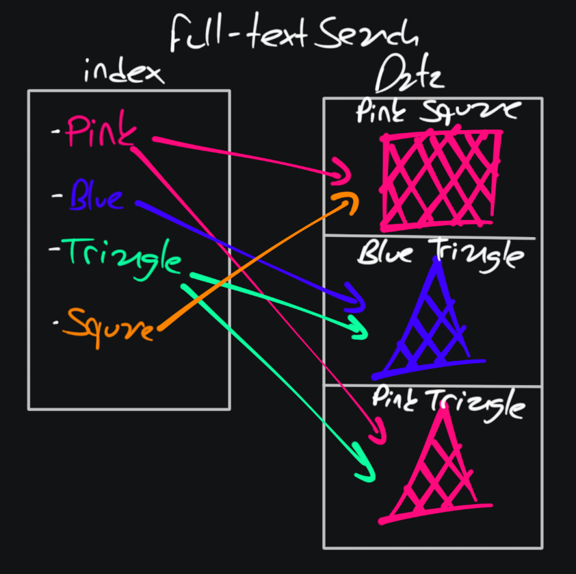
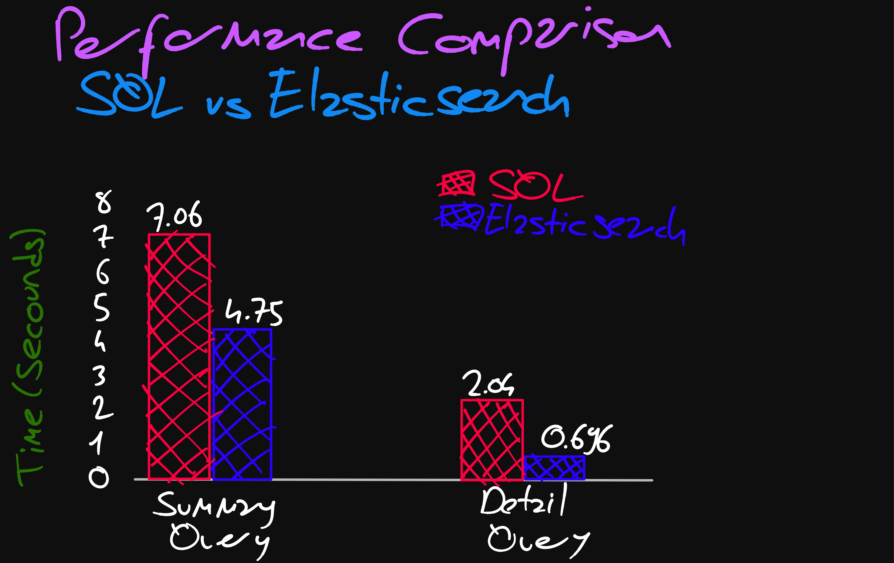
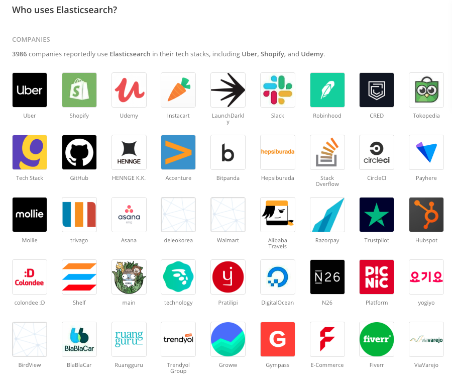

# Elasticsearch-Workshop

## Icerik
- [Elasticsearch Nedir?](#elasticsearch-nedir)
- [Full Text Search Nedir?](#full-text-search-nedir)
- [Elasticsearch'un Avantajlari](#elasticsearchun-avantajlari)
- [Elasticsearch Temel Kavramlari Neler?](#elasticsearch-temel-kavramlari-neler)
- [Elasticsearch Kullanim Alanlari](#elasticsearch-kullanim-alanlari)
- [Elasticsearch vs SQL](#elasticsearch-vs-sql)
- [Elasticsearch Sorgu Tipleri](#elasticsearch-sorgu-tipleri)
- [Elasticsearch'u Kimler Kullaniyor?](#elasticsearchu-kimler-kullaniyor)
- [Endpoints ve Aciklamalari](#endpoints-ve-aciklamalari)
- [Elasticsearch'u Docker Uzerinde Calistirma](#elasticsearchu-docker-uzerinde-calistirma)
- [Tech Stack](#tech-stack)
- [Requirements](#requirements)
- [Build & Run](#build--run)
- [Kaynakca](#kaynakca)

## Elasticsearch Nedir?
Elasticsearch, veri arama, analiz ve gorsellestirme islemlerini hizli ve etkili bir sekilde gerceklestirmenizi saglayan bir acik kaynakli veri arama ve analiz platformudur. 
Elasticsearch, buyuk miktardaki verileri duzenli bir sekilde saklayabilen, hizli ve olceklenebilir bir veritabani ve arama motoru(**full-text search**) olarak dusunulebilir.

## Full Text Search Nedir?
<p align="center">
    
</p>

<p align="center">
    
</p>

## Elasticsearch'un Avantajlari

<p align="center">
    
</p>

- `High Performance(Yuksek Performans):`

  Elasticsearch, guclu tam metin arama yetenekleriyle bilinir. Apache Lucene altyapisi kullanarak ters indeksleme ve
  gelismis arama algoritmalari kullanarak hizli ve dogru arama sonuclari saglar. Tipik bir SQL veritabanindan daha
  hizlidir.


- `Near Real-Time Operations(Neredeyse Gercek Zamanli Islemler):`

  Veri okuma veya yazma gibi Elasticsearch islemleri genellikle bir saniyeden daha kisa surede tamamlanir. Bu nedenle
  Elasticsearch'ten uygulama izleme ve anormallik algilama gibi neredeyse gercek zamanli kullanim amaclari dogrultusunda
  faydalanabilirsiniz.


- `Lots of Search Options(Cok Sayida Arama Secenegi):`

  Elasticsearch, arama konusunda bircok ozellik sunar. Full-text search(tam metin arama),auto-complete(otomatik
  tamamlama), instant search(anlik arama) ve daha fazlasini alabilirsiniz.

  Autocompletion(Otomatik tamamlama) ve instant search(anlik arama), yazarken oneriler sunar. Oneriler, arama gecmisi
  veya ilgilige dayali olarak tahmin edilir. Ayrica yazim hatasi varsa bile kullanicilar ilgili aramalar alir.


- `Distributed Approach(Dagitik mimari):`

  Elasticsearch, dagitik bir mimaride calisir. Sonuc olarak, buyuk miktarda veriyi hizli bir sekilde isleyebilir.
  Diziler parcalara ayrilir. Parcalar tam islevli bir dizin gibi calisir. Her parcada cok sayida kopya olabilir. Bu
  parcalari Elasticsearch kumesinin herhangi bir yerine barindirabilirsiniz.


- `Cluster and Backup Support (Cluster ve Yedekleme Destegi):`

  Elasticsearch, coklu dugumlerden (nodes) olusan bir kume (cluster) icinde calisabilir. Bu, yuksek kullanilabilirlik
  saglamak ve veri kaybini onlemek icin onemlidir. Ayrica, verilerin yedeklenmesi icin kapsamli bir sistem sunar.


- `Plugins and Integrations(Eklentiler ve Entegrasyonlar):`

  Elasticsearch, eklentiler ve entegrasyonlarla yuksek uyumludur. Eklentiler, islevselligi artirmak ve aramalari
  ozellestirmek icin kullanilir. Ozel eslemeler, analizciler ve kesifler eklemeye yardimci olur.


- `RESTful API:`

  Elasticsearch, sundugu basit REST tabanli API'ler sayesinde hizmeti hizla kullanmaya baslamanizi ve farkli kullanim
  orneklerine uygun uygulamalar tasarlamanizi saglar.


- `Security(Guvenlik):`

  Elasticsearch, kullanici kimlik dogrulama, erisim kontrolu ve veri sifreleme gibi guvenlik onlemlerini destekler.


- `Easy Application Development:`

  Kolay uygulama gelistirme Java, Python, PHP, JavaScript, Node.js, Ruby ve daha bircok dil icin destek sunar.

## Elasticsearch Kullanim Alanlari
`1. Web Arama ve Indeksleme`<br>

`2. Metin Analizi ve Madencilik`<br>

`3. Log Yonetimi`<br>

`4. Muzik ve Medya Isleme`<br>

`5. E-ticaret ve Pazarlama`<br>

`6. Urun ve Icerik Onerileri`<br>

`7. Finansal Veri Analizi`<br>

## Elasticsearch Temel Kavramlari Neler?
`index = database`<br>
`field = column`<br>
`document = row`<br>
`type = table`<br>

<details>
<summary>Index</summary>
Elasticsearch'te verilerin duzenli bir sekilde depolandigi birimdir ve genellikle bir kutuphane koleksiyonunu temsil eder. Ornegin, bir kutuphane sistemi, kitaplarin depolandigi bir "kitaplar" endeksi olusturabilir.
</details>

<details>
<summary>Document</summary>
Elasticsearch endekslerinde saklanan verilerin temel yapi tasidir. Genellikle JSON formatinda bilgileri icerir ve bir kitabin tum ayrintilarini icerebilir, bu da kitap adi, yazar, yayin tarihi gibi bilgileri icerir.
</details>

<details>
<summary>Field</summary>
Elasticsearch dokumanlari icindeki verileri temsil eden bilesendir. Ornegin, bir kitap dokumaninda "kitap adi" veya "yazar" gibi alanlar birer field'dir.
</details>

<details>
<summary>Type (Tur, Artik Onerilmemektedir)</summary>
Elasticsearch 6.0 ve sonraki surumlerde kullanimdan kaldirilmis olsa da, Elasticsearch 5.0 ve onceki surumlerde bulunan bir kavramdir. Type, bir dizindeki belgelerin altinda bulunan turdur.
</details>

<details>
<summary>Indexing</summary>
Elasticsearch'te yeni dokumanlarin endekslendigi veya mevcut dokumanlarin guncellendigi islemdir. Veri eklemek veya degistirmek icin kullanilir.
</details>

<details>
<summary>Query</summary>
Elasticsearch'te veri sorgulamak icin kullanilan bir terimdir. Belirli kriterlere uyan dokumanlari aramak veya filtrelemek icin kullanilir.
</details>

<details>
<summary>Mapping</summary>
Elasticsearch'te veri yapisini tanimlayan bir yapidir. Hangi alanlarin hangi veri turlerini icerdigini ve hangi analizleri uyguladiginizi belirtir. Ornegin, bir alanin metin veya sayi veri turunde oldugunu ve dil analizi uygulandigini belirtmek icin kullanilir.
</details>

<details>
<summary>Analysis</summary>
Elasticsearch'te metin verilerinin islenme surecidir. Metinleri dil analizi ve belirli kriterlere gore ayristirma islemi icerir. Bu, metin tabanli aramalari daha etkili hale getirir.
</details>

<details>
<summary>Cluster</summary>
Elasticsearch sunucularinin bir araya gelerek olusturdugu bir yapidir. Verilerin guvenli bir sekilde depolanmasi ve sorgulanmasi icin kullanilir.
</details>

<details>
<summary>Node</summary>
Elasticsearch kumesinin bir parcasi olan bir sunucu veya dugumdur. Verileri depolar ve sorgulari isler. Birden cok node, bir cluster olusturur.
</details>

<details>
<summary>Shard</summary>
Elasticsearch endekslerinin bolundugu fiziksel veya mantiksal birimlerdir. Veri dagitimini ve performansi optimize etmeye yardimci olur.
</details>

<details>
<summary>Replica</summary>
Bir endeksin yedek kopyasidir ve veri yedeklemesi saglar. Arizali bir nodenin yerine gecebilir ve veri kaybini onler.
</details>

## Elasticsearch vs SQL

<p align="center">
    
</p>

<details>
<summary>Summary Query Nedir?</summary>

**Summary Query:** Genel bir bakis sunar. Genellikle veri toplamalarini ve sonuclari daha yuksek duzeyde ozetlemeyi
amaclar.

Ornegin, bir musterinin toplam siparis tutarini gosterir:

```sql
SELECT musteri_id,
       ad,
       soyad,
       SUM(siparis_tutari) AS toplam_siparis_tutari
FROM Musteriler
GROUP BY musteri_id, ad, soyad
```

Bu sorgu, her musterinin adini, soyadini ve toplam siparis tutarini ozetler.
</details> 

<details>
<summary>Detail Query Nedir?</summary>

**Detail Query:** daha spesifik veya ayrintili verileri cekmeyi amaclar. Bu tur sorgular, genellikle belirli bir kosulu
karsilayan veya belirli bir veri kesimini getiren sorgulardir.

Ornegin, belirli bir musterinin siparislerini listeleyecektir.

```sql
SELECT musteri_id,
       siparis_id,
       siparis_tarihi,
       urun_adi,
       miktar,
       siparis_tutari
FROM Siparisler
WHERE musteri_id = 'belirli_musteri_id'
```

Bu sorgu, belirli bir musterinin (musteri kimlik numarasina gore filtrelenmis) her bir siparisini ve siparislerin
ayrintilarini listeleyecektir.
</details> 

## Elasticsearch Sorgu Tipleri

<details>
<summary>Match Query</summary>
Belirli bir metin terimini veya sorgu ifadesini arar ve eslesen belgeleri dondurur.
</details>

<details>
<summary>Term Query</summary>
Belirli bir alanin degerinin tam eslesme icin kullanilir.
</details>

<details>
<summary>Bool Query</summary>
Mantiksal operatorleri (AND, OR, NOT) kullanarak birden cok sorguyu birlestirmek icin kullanilir.
</details>

<details>
<summary>Range Query</summary>
Bir alanin belirli bir araliga dusup dusmedigini kontrol eder.
</details>

<details>
<summary>Match Phrase Query</summary>
Metin teriminin tamamini iceren belgeleri dondurmek icin kullanilir.
</details>

<details>
<summary>Fuzzy Query</summary>
Benzer ancak kesin olmayan terimleri aramak icin kullanilir.
</details>

<details>
<summary>Wildcard Query</summary>
Jokert karakterler (* veya ?) kullanarak eslesen terimleri bulmak icin kullanilir.
</details>

<details>
<summary>Prefix Query</summary>
Belirli bir on ek ile baslayan terimleri aramak icin kullanilir.
</details>

<details>
<summary>Autocomplete Suggester</summary>
Otomatik tamamlama islevselligi icin kullanilir ve kullanicinin yazmaya basladigi terimleri tamamlamak icin kullanilir.
</details>

<details>
<summary>Highlighting</summary>
Eslesen terimleri veya metni vurgulamak icin kullanilir.
</details>

<details>
<summary>Aggregations</summary>
Verileri toplamak, gruplamak ve analiz etmek icin kullanilir.
</details>

<details>
<summary>Ranking Functions</summary>
Elasticsearch'in belgeleri siralamak icin kullanabileceginiz cesitli siralama islevleri vardir.
</details>

## Elasticsearch'u Kimler Kullaniyor?

<p align="center">
    
</p>

## Endpoints ve Aciklamalari
<table style="width:100%">
  <tr>
      <th>Method</th>
      <th>Method Name</th>
      <th>Url</th>
      <th>Description</th>
      <th>Request Body</th>
  </tr>
  <tr>
      <td>POST</td>
      <td>createIndex</td>
      <td>/api/v1/items</td>
      <td>Elasticsearch veritabanina veri eklemeyi saglar.</td>
      <td>Item<br>
      {
        "id": "99",
        "name": "test",
        "price": 1,
        "brand": "test",
        "category": "test"
      }</td>
  <tr>
  <tr>
      <td>POST</td>
      <td>addItemsFromJson</td>
      <td>/api/v1/items/init-index</td>
      <td>JSON'daki verileri alip Elasticsearch veritabanina kayit eder.</td>
      <td></td>
  <tr>
  <tr>
      <td>GET</td>
      <td>findAll</td>
      <td>/api/v1/items/findAll</td>
      <td>Elasticsearch veritabanina kaydedilmis tum verileri getirir.</td>
      <td></td>
  <tr>
  <tr>
      <td>GET</td>
      <td>getAllItemsFromAllIndexes</td>
      <td>/api/v1/items/allIndexes</td>
      <td>Elasticsearch veritabani icindeki tum indekslerdeki verileri getirir.</td>
      <td></td>
  <tr>
  <tr>
      <td>GET</td>
      <td>getAllDataFromIndex</td>
      <td>/api/v1/items/getAllDataFromIndex/{indexName}</td>
      <td>Elasticsearch veritabani icindeki istenilen indekslerdeki verileri getirir.</td>
      <td></td>
  <tr>
  <tr>
      <td>GET</td>
      <td>searchItemsByFieldAndValue</td>
      <td>/api/v1/items/search</td>
      <td>Elasticsearch veritabaninda istenilen alanda istenilen veriyi arar.</td>
      <td>SearchRequestDto<br>
      {
        "fieldName": [
            "name"
        ],
        "searchValue": [
            "Ultimate"
        ]
      }
      </td>
  <tr>
  <tr>
      <td>GET</td>
      <td>searchItemsByNameAndBrandWithQuery</td>
      <td>/api/v1/items/search/{name}/{brand}</td>
      <td>Elasticsearch veritabaninda isme ve markaya gore arama yapar.</td>
      <td></td>
  <tr>
  <tr>
      <td>GET</td>
      <td>boolQuery</td>
      <td>/api/v1/items/boolQuery</td>
      <td>Elasticsearch veritabaninda istenilen alanda istenilen veriyi bool query olarak arar.</td>
      <td>SearchRequestDto<br>
      {
        "fieldName": [
            "name",
            "brand"
        ],
        "searchValue": [
            "mega",
            "xyz"
        ]
      }
      </td>
  <tr>
  <tr>
      <td>GET</td>
      <td>autoSuggestItemsByName</td>
      <td>/api/v1/items/autoSuggest/{name}</td>
      <td>Bir urun adi alir ve Elasticsearch veritabaninda bu ada benzer urun adlarini bulup dondurur.</td>
      <td></td>
  <tr>
  <tr>
      <td>GET</td>
      <td>autoSuggestItemsByNameWithQuery</td>
      <td>/api/v1/items/suggestionsQuery/{name}</td>
      <td>Bir urun adi alir ve Elasticsearch veritabaninda bu ada benzer urun adlarini bulup dondurur.</td>
      <td></td>
  <tr>
</table>

### searchItemsByNameAndBrandWithQuery'nin custom query'sinin aciklamasi:
```java
@Query("{\"bool\": {\"must\": [{\"match\": {\"name\": \"?0\"}}, {\"match\": {\"brand\": \"?1\"}}]}}")
List<Item> searchItemsByNameAndBrandWithQuery(String name, String brand);
```
- **bool:** Bu, Elasticsearch sorgusunun bir "bool" (boolean) sorgusu oldugunu belirtir. Bool sorgusu, baska sorgulari bir araya getirme ve mantiksal islemler yapma yetenegi saglar.

- **must:** Bool sorgusunun icinde yer alan "must" bolumu, bu sorgunun icermesi gereken kosullari belirtir. Yani, bu sorgu, hem adi hem de markayi icermesi gereken belgeleri arar.

- **match:** Bu, bir alanin (field) icerigini belirtilen bir degerle eslestirmek icin kullanilan sorgu turunu belirtir.

- **name ve brand:** Bu, her bir "match" sorgusunun eslesecegi alanlarin adini belirtir. Yani, "name" alani belirtilen name degeri ile eslesmeli ve "brand" alani belirtilen brand degeri ile eslesmelidir.

- **"?0" ve "?1":** Bu, "match" sorgularinin eslesecegi degerleri temsil eder. ?0 ve ?1 ifadeleri, bu sorgunun metodun parametrelerine sirasiyla name ve brand degerlerini alacagini gosterir. Yani, bu parametreler ile belirtilen degerlerle eslesmeyi arar.


## Elasticsearch'u Docker Uzerinde Calistirma
Elasticsearh'u docker uzerinden calistirmak icin docker-compose.yml dosyasini kullanabilirsiniz.
Bu dosyayi kullanarak Elasticsearch 8.8.0 surumunu calistirabilirsiniz.

```dockerfile
version: '3'
services:
  elasticsearch:
    image: elasticsearch:8.8.0
    environment:
      - discovery.type=single-node
      - validate_after_inactivity=0
      - max_open_files=65536
      - max_content_length_in_bytes=100000000
      - transport.host=elasticsearch
      - xpack.security.enabled=false
    volumes:
      - $HOME/app:/var/app
    networks:
      - my-network
    ports:
      - "9200:9200"
      - "9300:9300"

networks:
  my-network:
```


## Tech Stack

- Java 17
- Spring Boot 3.0
- Spring Elasticsearch Data
- Docker
- Lombok

## Requirements

For building and running the application you need:

- [JDK 17 or newer](https://www.oracle.com/java/technologies/javase-downloads.html)
- [Elasticsearch 8.x](https://www.elastic.co/downloads/elasticsearch)
- [Maven](https://maven.apache.org)
- [Lombok](https://projectlombok.org/)
- [Docker](https://www.docker.com/)

## Build & Run

```
  docker-compose -f docker-compose.yml up -d
```

```
  mvn clean install && mvn --projects backend spring-boot:run
```

## Kaynakca:
- https://www.youtube.com/playlist?list=PLoNChWlyFPxcB-jY277teAoJXtNNCcifM
- https://www.elastic.co/
- https://aws.amazon.com/what-is/elasticsearch/
- https://www.borakasmer.com/elasticsearch-nedir/
- https://www.gencayyildiz.com/blog/elasticsearch-nedir-temel-kavramlari-nelerdir/
- https://www.mdpi.com/2076-3417/11/24/11590
- https://medium.com/@kdrcandogan/elasticsearch-nedir-45d237c29b26
- https://www.gtech.com.tr/elasticsearch-esnek-arama-nedir/
- https://www.hosting.com.tr/blog/elasticsearch/
- https://miuul.com/not-defteri/elasticsearch-nedir-neden-kullanilmalidir
- https://www.alastyr.com/blog/elasticsearch-nedir-ne-ise-yarar/
- https://sematext.com/guides/elasticsearch/
- https://webo.digital/blog/what-is-elasticsearch-why-use-it/
